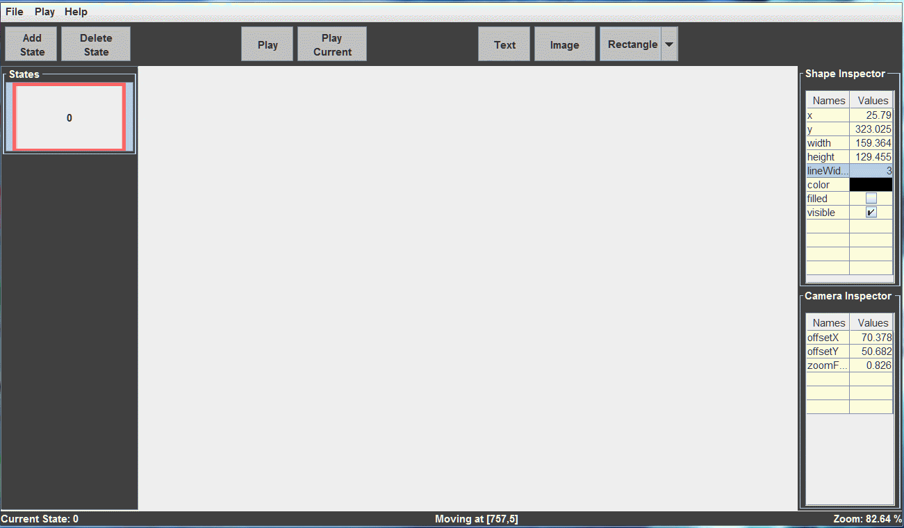
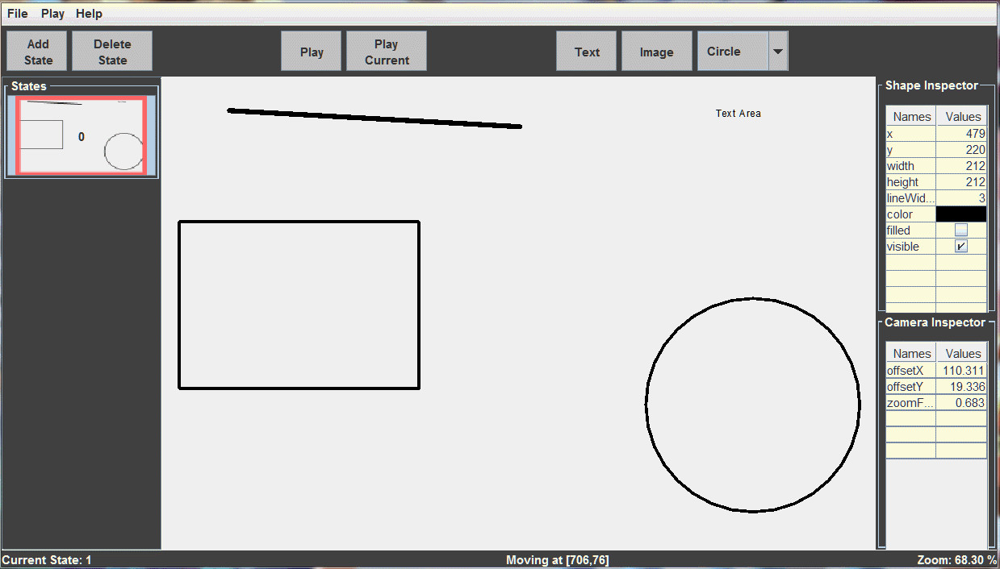
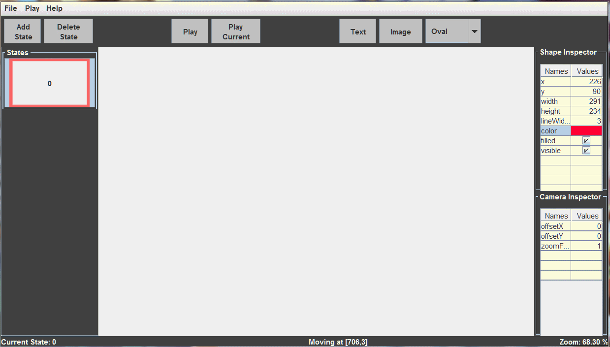
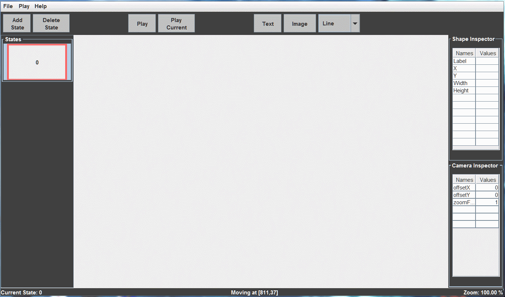
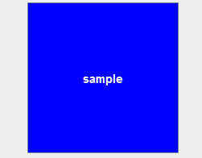

# PreZoom 

2020-9874-Team Charlie

A presentation application that combines features of PowerPoint, Prezi, and Keynote.

## Feature Show Cases

* Drawing Objects

* Interpolating animation between two states(slides)

* Color animation

* Canvas navigation

## Third Party Library
+ Trident
    - Trident provides powerful and flexible animation APIs that scale from simple, single-property cases to complex scenarios that involve multiple animations.
    - Trident is part of [Radiance](https://github.com/kirill-grouchnikov/radiance).
    - Find Trident documentation [here](https://github.com/kirill-grouchnikov/radiance/blob/master/docs/trident/trident.md).
    - Our project uses Trident to build [timelines](https://github.com/kirill-grouchnikov/radiance/blob/master/docs/trident/TimelineLifecycle.md) and [interpolations](https://github.com/kirill-grouchnikov/radiance/blob/master/docs/trident/TimelineInterpolatingFields.md) for the camera and objects.
    - Trident examples:
      - | [Example 1](https://github.com/kirill-grouchnikov/radiance/blob/master/docs/trident/SimpleSwingExample.md) | [Example 2](https://github.com/kirill-grouchnikov/radiance/blob/master/docs/trident/ParallelSwingTimelines.md) |
        | :---------: | :---------: |
        |  |  |

## Documentation

* [Proposal-PreZoom Inception](docs/2020-prezoom-inception-doc.pdf)

* [design folder](docs/design)
    - [x] [High-level design document](docs/design/High-level_Design.md).
        + [x] Packages UML.
        + [x] Description of our packages.
        + [x] Description of third party packages.
        + [x] Classes UML.
        + [x] Classes Description.
    - [x] [Test plan](docs/design/Test_Plan.md).
    - [x] [Compile instruction](docs/design/Compile_Instruction.md).
 

* [src folder](src)
    - [x] Source code.
    - [x] JavaDoc each class.
    - [x] JavaDoc each public method.
 
  
* [tstsrc folder](tstsrc)
    - [x] JUnit automated tests
 

* [Requirements document](docs/requirements/Requirements.md)
    - [x] Domain model
    - [x] Lexicon
    - [x] list of requirements, two sections:
      - plans for Iteration 1
      - plans for Iteration 2
    - [x] Revise the requirement document.
    - [x] Indicate the state of each user story.
    - [x] Revise the list of user stories. 
 
    
* [Specification document](docs/requirements/Specification.md)
    - [x] Use case diagram
    - [x] State diagram
    - [x] Use cases
    - [x] Wire frame diagrams
    - [x] Sequence diagrams 
    - [x] Update use cases that cover all user stories.
 
     
