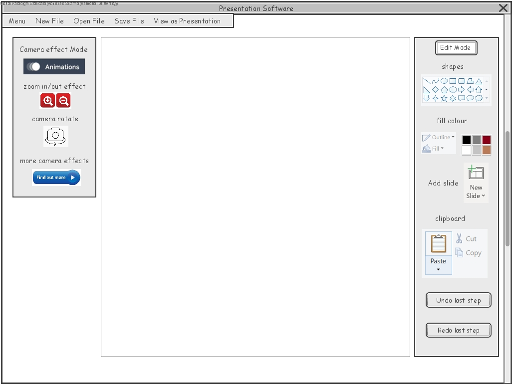
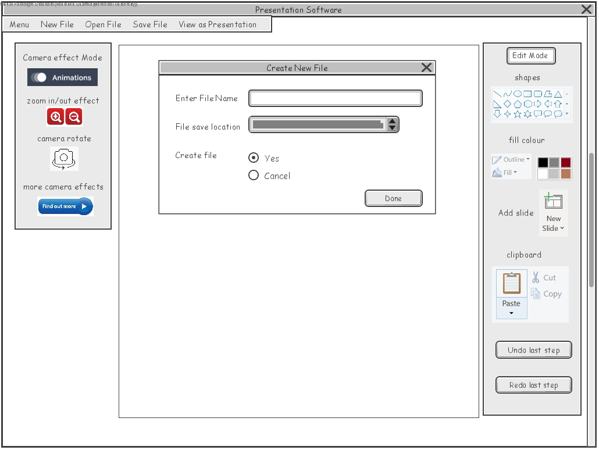
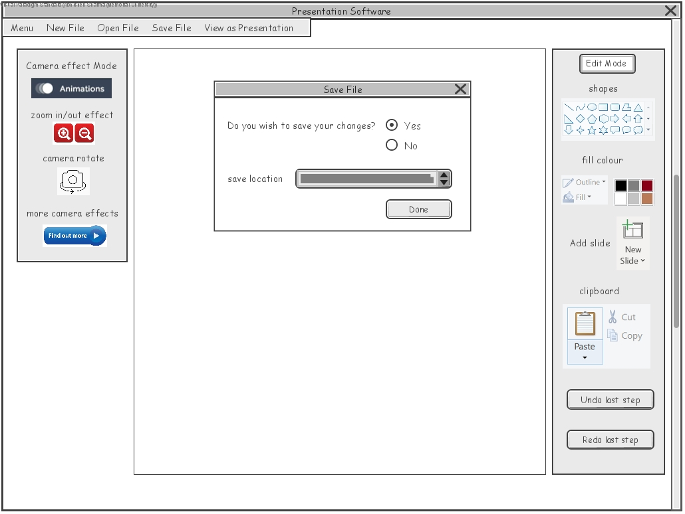
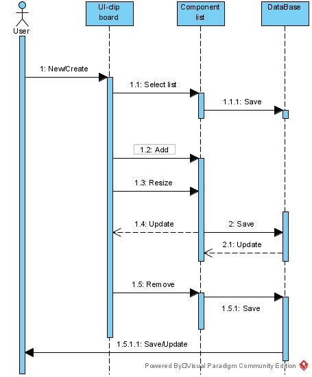

# Specification

## Table of Contents
  - [Use Case Diagram](#use-case-diagram)
  - [State Diagram](#state-diagram)
  - [User Stories](#user-stories)
  - [Use Cases](#use-cases)
  - [Wire Frame Diagrams](#wire-frame-diagrams)
  - [Sequence Diagrams](#sequence-diagrams)

## Use Case Diagram

## State Diagram

__A subsystem for edit file state can be viewed below__:

## User Stories
R0: User will be able to save the presentation to a file by the presentation software.  
R1: User will be able to load the presentation from a file by the presentation software.

__In Edit mode__:  
R2: User will be able to add graphical objects to the presentation.  
R3: User will be able to delete graphical objects from the presentation.  
R4: User will be able to move graphical objects.  
R5: User will be able to add a state at any point.  
R6: User will be able to delete a state at any point.  
R7: User will be able to prezoom.view the presentation at any state.   
R8: User will be able to change the values of the various attributes of graphical objects in the state currently being viewed.  
R9: User will be able to change the trigger condition for moving from one state to the next.  
R10: User will be able to change the way that interpolation during a transition happens.  
R11: User will be able to change the amount of time it takes to move from one state to the next.  
R12: User will be able to zoom, pan, and orient (operand) the current prezoom.view-port.  
R13: User will be able to move from edit mode to presentation mode either starting at the beginning or starting at the current state.  
R14: User will be able to undo in Edit mode.  
R15: User will be able to redo in Edit mode.  
R16: User will be able to cut, copy, and paste operations using the platform's clipboard.  
R19: Software will contain a camera to indicate the region of the sheet  

__In Presentation mode__:  
R17: User will be able to exit Presentation mode and entering Edit mode.  
R18: User will be able to control the state of the presentation.  

## Use Cases
1)  Save file  
Use case name: SaveFile  
Actor: User  
Requirement addressed: R0  
Precondition: a new presentation has been finished  
Typical flow: click the "save" button  
Postcondition: the presentation is saved to the designated folder  
  
2)  Load File  
Use case name: LoadFile  
Actor: User  
Requirement addressed: R1  
Precondition: a certain presentation file existed in the designated folder  
Typical flow:    
    1.	Click the "load" button  
    2.	Select the presentation file which user need  
Postcondition: the presentation loaded to the software  
  
3)	Add Graph Objects  
Use case name: AddGraphObj  
Actor: User  
Requirement addressed: R2  
Precondition: in the edit mode  
Typical flow:   
    1.	Choose a kind of graph object to add through button  
    2.	Determine the position of the graph object through dragging mouse (MoveGraph)  
Postcondition: a graph object is added  
  
4)	Delete Graph Objects  
Use case name: DeleteGraphObj  
Actor: User  
Requirement addressed: R3  
Precondition: in the edit mode and at least one graph object has been added  
Typical flow:   
    1.	Select the object which is needed to delete  
    2.	Click the "delete" button  
Postcondition: a graph object is deleted  
  
5)	Move Graph Objects  
Use case name: MoveGraph  
Actor: User  
Requirement addressed: R4  
Precondition: in the edit mode and at least one graph object has been added  
Typical flow:   
    1.	Select the object and drag the mouse to the destination  
    2.	Move the object  
Postcondition: a graph object is moved  
  
6)	Add State  
Use case name: AddState  
Actor: User  
Requirement addressed: R5  
Precondition: in the edit mode  
Typical flow: add any operation of the presentation or change the attributes of objects  
Postcondition: a new state is added  
  
7)	Delete State  
Use case name: DeleteState  
Actor: User  
Requirement addressed: R6  
Precondition: in the edit mode  
Typical flow: Delete any operation of the presentation  
Postcondition: a state is deleted  
  
8)	View presentation  
Use case name: ViewPresentation  
Actor: User  
Requirement addressed: R7  
Precondition: in the edit mode  
Typical flow: Click the "presentation" button  
Postcondition: current edit mode is presented  
  
9)	Change Attributes of Object  
Use case name: ChangeAttributes  
Actor: User  
Requirement addressed: R8  
Precondition: in the edit mode and at least one graph object has been added  
Typical flow:  
    1.	Select the object user wants to change  
    2.	Click the mouse to choose the attributes  
    3.	Change the value of attributes  
Postcondition: the attributes of object are changed  
  
10)	Change Trigger Condition  
Use case name: ChangeTrigger  
Actor: User  
Requirement addressed: R9  
Precondition: in the edit mode  
Typical flow:  
    1.	Click "Trigger" button  
    2.	Choose one of the trigger conditions  
Postcondition: the trigger condition is changed  
  
11)	Change Interpolation  
Use case name: ChangeInterpolation  
Actor: User  
Requirement addressed: R10  
Precondition: in the edit mode and at least one graph object has been added  
Typical flow:  
    1.	Click "Interpolation" button  
    2.	Choose the style of interpolation   
Postcondition: the interpolation of object is changed  
  
12)	Change Duration  
Use case name: ChangeDuration  
Actor: User  
Requirement addressed: R11  
Precondition: in the edit mode and at least one trigger has been actived  
Typical flow:  
    1.	Click "Duration" button  
    2.	Set the duration time  
Postcondition: the duration is changed  
  
13)	View Port Operations  
Use case name: ViewPortOperation  
Actor: User  
Requirement addressed: R12  
Precondition: in the edit mode  
Typical flow:  
    1.	Click the "Zoom", "Pan", "Orient" button  
    2.	Current prezoom.view port will follow the operations  
Postcondition: the operation is finished  
  
14)	Change Mode  
Use case name: MoveMode  
Actor: User  
Requirement addressed: R13 and R17  
Precondition: in the edit mode or in the presentation mode  
Typical flow:  
    1.	Click "Mode" button  
    2.	If in the edit mode, it will be changed to the presentation mode. Vice versa.  
Postcondition: the mode is changed  
  
15)	Undo  
Use case name: Undo  
Actor: User  
Requirement addressed: R14  
Precondition: in the edit mode  
Typical flow:  
    1.	Click "Undo" button  
    2.	Current operation is back to the previous step  
Postcondition: undo is finished  
  
16)	Redo  
Use case name: Redo  
Actor: User  
Requirement addressed: R15  
Precondition: in the edit mode  
Typical flow:  
    1.	Click "Redo" button  
    2.	The Undo operation will redo  
Postcondition: redo is finished  
  
17)	Clipboard Operations  
Use case name: ClipboardOperations  
Actor: User  
Requirement addressed: R16  
Precondition: in the edit mode  
Typical flow:  
    1.	Click buttons (cut, copy, etc.) on the clipboard  
    2.	The corresponding operation will be implemented  
Postcondition: The corresponding operation is implemented  
  
18)	Presentation Control  
Use case name: PresentationControl  
Actor: User  
Requirement addressed: R18  
Precondition: in the presentation mode  
Typical flow:  
    1.	Click buttons or the presentation area  
    2.	The presentation will go to next state  
Postcondition: presentation is controlled  
  
19)	Camera  
Use case name: Camera  
Actor: PresentationSoftware  
Requirement addressed: R19  
Precondition: in the edit mode  
Typical flow: the software contains a camera area to indicate the region  
Postcondition: the presentation region is indicated  

## Wire Frame Diagrams
__Main screen when application is started can be viewed below__:

__A subwindow for creating a new file can be viewed below__:

__A subwindow to load existing file can be viewed below__:

__A subwindow to save a file can be viewed below__:

## Sequence Diagrams

__Main__:   

__Clip Board__:  

